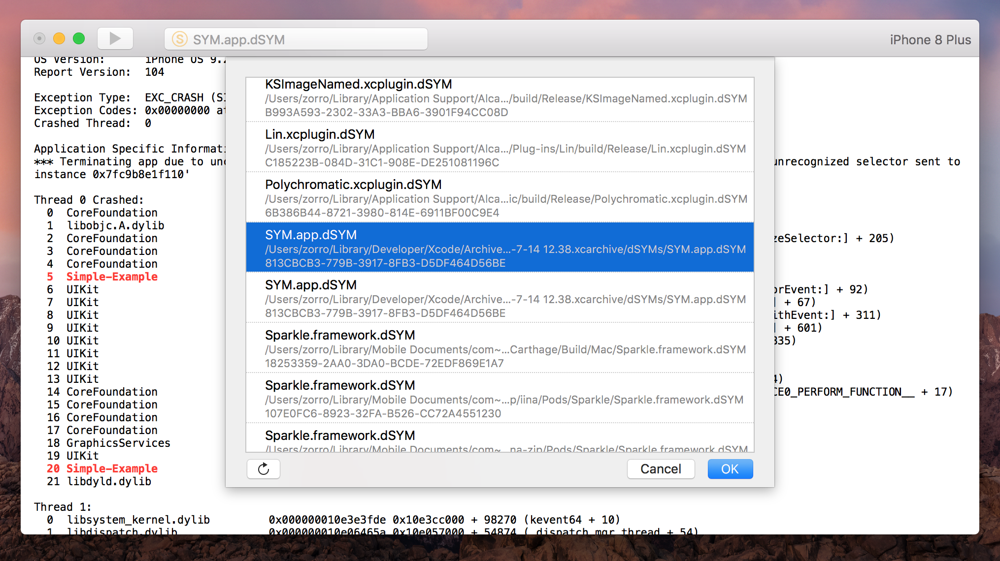

   

# SYM

An app for crash symbolicating. 

Download the latest version from [here](https://github.com/zqqf16/SYM/releases/latest).

## Features

1. Support Umeng and Apple format crash report.
2. Automatically search dSYM files.
3. Highlight key backtrace frames.

## Usage

Open or paste in a crash report, click the "Symbolicate" button.

## Example

