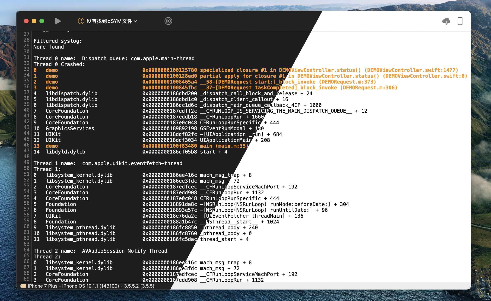

[](https://github.com/zqqf16/SYM/actions/workflows/test.yml) [](https://github.com/zqqf16/SYM/issues) [](https://raw.githubusercontent.com/zqqf16/SYM/master/LICENSE) [](https://twitter.com/zqqf16)

# SYM

A macOS app for symbolicating iOS/macOS crash reports.

Download the latest version from [here](https://github.com/zqqf16/SYM/releases/latest).

## Features

- Structured parsing for Apple IPS/JSON, classic `.crash`, Umeng, Fabric/Crashlytics plaintext, CPU usage, and Keep JSON reports
- In-process symbolication via Mach-O symbol tables (MachOKit) with `atos` fallback — no Perl `symbolicatecrash`
- Automatic dSYM discovery via Spotlight, plus customizable download scripts
- On-device crash report import
- Sandbox file browser with search, multi-select, sorting, breadcrumbs, and text preview
- Pure AppKit + SnapKit UI (no storyboards); SF Symbols for toolbar/icons

## Requirements

- macOS 13+
- Xcode Command Line Tools (for `atos` / `dwarfdump` fallbacks)

## Usage

1. Open a crash report with SYM, or paste report content into the editor.
2. Wait for matching dSYMs to appear (or import them).
3. Click **Symbolicate**.

## Architecture

```
Crash input → CrashDecoding → CrashReport model
                ↓                    ↓
         CrashFormatter        SymbolEngine (MachO → atos)
                ↓                    ↓
           Text editor ← formatted + symbolicated report
```

Device support uses a vendored static build of libimobiledevice. Rebuild with:

```bash
cd SYM/Device && ./build.sh
```

## Example



---

# SYM

一个图形化的崩溃日志符号化工具，最新版本下载地址：[https://github.com/zqqf16/SYM/releases/latest](https://github.com/zqqf16/SYM/releases/latest)

## 主要功能

- 结构化解析：Apple IPS/JSON、经典 `.crash`、友盟、Fabric、CPU usage、Keep JSON
- 进程内符号化（MachOKit + `atos` 兜底），不再依赖 Perl `symbolicatecrash`
- 自动查找 dSYM，支持自定义下载脚本
- 从设备导入崩溃日志
- 沙盒文件浏览（搜索、多选、排序、面包屑、文本预览）
- 纯 AppKit + SnapKit UI，工具栏使用 SF Symbols

## 系统要求

- macOS 13+

## 使用方法

1. 用 SYM 打开崩溃日志，或把内容粘贴进编辑器。
2. 等待 dSYM 自动匹配（或手动导入）。
3. 点击「符号化」。
